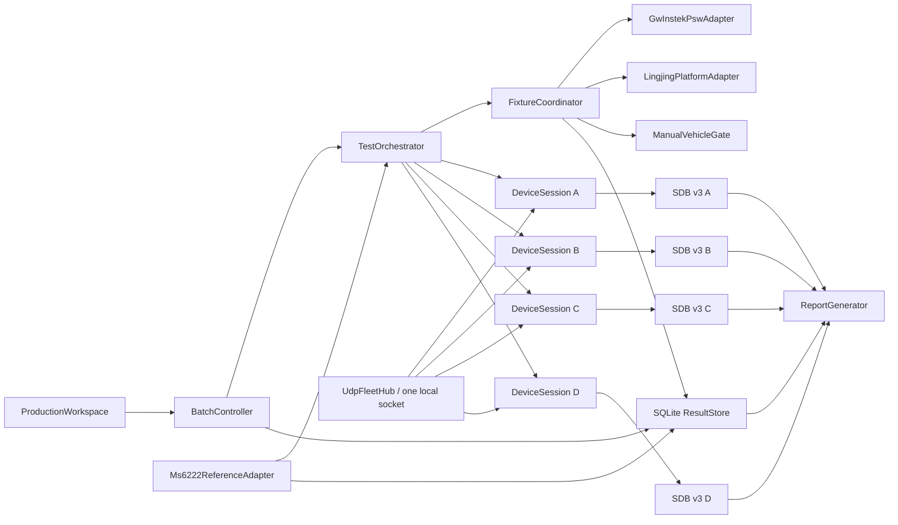

# M19 小批试产批量测试工作站计划

## 1. 文档信息

| 项目 | 内容 |
|------|------|
| 日期 | 2026-08-09 |
| 状态 | 待用户确认测试判据后实施 |
| 首期设备 | AFD01，最多 4 台并发 |
| 上位机验收 | `doc/M19_batch_production_test_station_acceptance.md` |
| 开发记录 | `doc/M19_batch_production_test_station_dev_log.md` |

## 2. 目标与边界

把现有单机调试/客户工具扩展为一个独立的“小批试产测试工作站”，完成：

- 测试人员创建批次，录入或导入本批固件与参数标准。
- 自动探测同一网段内的 AFD01，以序列号为主键建立最多 4 个隔离会话。
- 多台设备挂在同一电源、载具和摇摆台上，并行承受同一物理激励，各自独立采集、判定和出报告。
- 自动控制局域网电源和摇摆台；车辆仍由测试人员驾驶，上位机负责流程门禁、提示、计时和证据记录。
- 上位机逐项提示操作、自动采集、自动计算指标并明确给出通过、失败或不完整。
- 每台设备独立保存全量 SDB 证据，并生成独立 PDF/HTML 和 JSON 测试报告。
- 批次结束生成汇总 CSV，便于统计通过率和定位失败项。

共享夹具动作以批次为单位执行，不能把物理上的同一次摇摆或断电伪装成四个互不相关的设备动作。单台掉线或失败通常只影响该设备结论；夹具故障、安全异常或操作员急停会中止整个批次动作。单台补测创建新 attempt，必要时再次驱动共享夹具，其他设备可继续录制但不参与该 attempt 的判定。

本功能不放进客户工作区，也不复用客户页面作为测试页。建议同一程序增加 `production` 工作区和专用启动参数/快捷方式，避免试产流程与客户操作、工程诊断相互干扰。

## 3. 当前源码审查结论

| 能力 | 当前状态 | M19 处理 |
|------|----------|----------|
| UDP 连接 | 一个 `LiveView` 只拥有一个 `UdpWorker`，固定一个远端和本地端口 | 新增共享 UDP Hub，按来源 IP/端口分发到设备会话 |
| 自动等待上电 | 单机固定 IP 已可先绑定 socket 后等待设备出现 | 扩展为网段探测、持续发现和多会话重连 |
| 产品运行数据 | AFD01 Product Service 已提供身份、跟踪、锁定、姿态、波束、SNR、位置、组件和 PLL 状态 | 直接复用，不依赖动态 Debug 定义完成流程判定 |
| 参数表 | 已有 `REQUEST_PARA_TABLE` 和类型化参数表 | 从 `DeviceView` 抽出无 UI 的只读参数客户端 |
| 全量录制 | SDB v3 已保存原始帧、主机时间、控制记录、metadata 和完整性计数 | 每台设备使用独立录制器并写入测试项边界/人工操作事件 |
| 共享摇摆台 | 已审查《南京灵境平台通讯协议》V0.3：UDP 9800、ASCII 指令、可下发姿态和到位时间；文档未定义 ACK、状态查询或位置回读 | 新增命令型夹具适配器，严格区分“已发送”“观察到运动”和“已确认到位” |
| 独立姿态参考 | 已审查 MS-6222 V1.03 手册和 2026 年版本变更：双天线 GNSS/INS 可输出 100 Hz 姿态、时间和质量字段，但 0.1° 航向指标以 2 m 基线为条件，且动态时延未给出 | 作为共享参考测量链接入；完成坐标、时间、基线和精度资格验证后才能产生 `POSE_VERIFIED` |
| 局域网电源 | 已确认目标为 GW Instek PSW 80-27：单通道、TCP/2268、SCPI + LF，支持身份、设定值、输出状态、实测电压/电流、CV/CC 和保护状态回读 | 新增 `GwInstekPswAdapter`，以输出状态、实测电压和 DUT Boot Session 组成闭环上/断电证据 |
| 车辆 | 必须人工驾驶，无法由上位机自动控制 | 使用操作员门禁、倒计时、人工确认和设备/GNSS 数据佐证行驶窗口 |
| GNSS | 已有 Fix、位置、速度、卫星/信号记录和 C/N0 | 可做连续性、卫星/信号和静态稳定性；DOP、外部真值需补充 |
| IMU 静态性能 | 当前 Profile 没有原始六轴或稳定的生产统计报告 | 设备侧增加按窗口计算的 IMU 静态诊断结果 |
| 上电识别 | 可观察 uptime 重置，但没有稳定的启动实例 ID/复位原因 | 设备侧增加 Boot Session/Reset Reason 报告 |
| 报告与追溯 | 当前没有批次数据库和报告生成器 | 新增 SQLite 结果库、PDF/HTML/JSON 和 CSV 导出 |

结论：版本、参数及大部分跟踪/GNSS 测试可复用现有协议；电源侧已有闭环控制条件，可靠的 DUT 重启识别仍需 AFD01 补充 Boot Session/Reset Reason。IMU 静态性能也需要设备侧补充类型化诊断数据，不能仅凭姿态角稳定就宣称通过。

## 4. 总体架构



### 4.1 共享 UDP Hub

- 工作站只绑定一个本地 UDP 端口，所有接收均携带来源 endpoint。
- Hub 按 `(source_ip, source_port)` 分流，不允许四个 worker 竞争同一端口。
- 在配置网段内周期发送无副作用探测请求，设备未上电时保持探测。
- 发现后先读取身份，以序列号去重；IP 只是可变 endpoint，不是设备主键。
- 检测重复序列号、IP 冲突、未知硬件和超过 4 台等异常并阻止批次启动。

### 4.2 DeviceSession

每台设备独立拥有：

- `FrameReceiverV2`、握手、Product Service、GNSS、参数客户端和状态缓存。
- 在线/离线/重连、Boot Session、数据质量和当前测试项状态。
- 独立的 SDB v3 录制器、队列丢弃计数和证据时间范围。
- 只读测试接口；试产流程不得隐式修改参数、射频或发射状态。

生产会话复用现有协议 decoder 和 store，但首期不强制重构现有 `LiveView`，避免影响已经工作的客户/工程路径。稳定后再评估是否统一会话核心。

### 4.3 FixtureCoordinator

`FixtureCoordinator` 是唯一可以改变共享物理环境的对象：

- 电源、摇摆台和车辆人工门禁均生成全局 `fixture_action_id`，所有参与设备 attempt 引用同一动作。
- 物理动作开始前设置同步屏障：目标设备录制器已 ARMED、身份无冲突、配方有效、夹具已预检、操作员已确认安全区域清空。
- 摇摆台状态分为 `DISCONNECTED / SAFE / ARMED / COMMAND_SENT_UNCONFIRMED / MOTION_OBSERVED / FAULT`。UDP 发送成功不得写成“平台到位”。
- 电源状态分为 `DISCONNECTED / IDENTIFIED / READY_OFF / TURNING_ON / ON_CONFIRMED / TURNING_OFF / OFF_CONFIRMED / PROTECTION_TRIPPED / UNKNOWN`；任何 TCP 断线首先进入 `UNKNOWN`，重连后只查询并重建状态，不自动重放“开输出”。
- 电源动作证据分为 `COMMAND_SENT / OUTPUT_STATE_CONFIRMED / VOLTAGE_CONFIRMED / DUT_BOOT_OBSERVED`。前三层属于共享电源动作；`DUT_BOOT_OBSERVED` 由每个 DeviceSession 分别确认并独立开始收敛计时，一台未启动不能拖延或替代其他设备的判定。
- 车辆动作固定为人工门禁：上位机提示驾驶员，操作员确认开始/结束，GNSS 速度和轨迹只作为辅助证据。
- 单台业务失败不自动停止其余设备；夹具越界、通信故障、物理急停或操作员中止必须停止整个共享动作。

跨设备和夹具事件以工作站单调时钟作为公共时间轴；每台设备同时保留自己的设备开机时间。指标窗口由同一个 `fixture_action_id` 和主机单调时间边界截取，避免四台设备 uptime 不同导致错位。

### 4.4 持久化与恢复

使用 Python 标准库 SQLite，开启 WAL，保存：

- 批次、测试配方快照及 SHA-256。
- 操作员、设备 SN/IP、固件和参数实测值。
- 每个测试项的每次 attempt、状态变化、人工确认和备注。
- 指标、单位、阈值、判定、SDB 证据区间及产物路径。
- 断电或程序崩溃后恢复为 `INCOMPLETE`，不得把未完成项当作通过。

## 5. 测试配方

测试人员可在 UI 中录入，也可导入 JSON。批次开始后配方锁定并复制到输出目录；修改标准必须新建修订版。

```json
{
  "schema_version": 1,
  "recipe_id": "AFD01-PILOT-2026-08-R1",
  "product": "afd01",
  "expected": {
    "main_firmware": {"match": "exact", "value": "0.0.130 beta"},
    "boot_firmware": {"match": "optional", "value": "0.0.3 beta"},
    "parameters": {
      "ext_ref_freq": {"type": "float", "value": 10.0, "abs_tol": 0.01},
      "modem_baud": {"type": "int", "value": 921600},
      "ip": {"type": "ip", "per_device": true}
    }
  },
  "fixtures": {
    "power_profile": "pilot_line_power_01",
    "motion_platform": {
      "driver": "lingjing_udp_v0_3",
      "command_family": "A6T",
      "center_pose": {"roll_deg": 0, "pitch_deg": 0, "yaw_deg": 0, "x_mm": 0, "y_mm": 0, "z_mm": 100},
      "reset_pose": {"roll_deg": 0, "pitch_deg": 0, "yaw_deg": 0, "x_mm": 0, "y_mm": 0, "z_mm": 0},
      "limits": {"roll_abs_deg": 15, "pitch_abs_deg": 15, "yaw_abs_deg": 30},
      "profile": {
        "profile_id": "afd01_marine_combined_v1",
        "sample_period_ms": 100,
        "ramp_in_s": 10,
        "steady_duration_s": 3600,
        "ramp_out_s": 10,
        "roll": {"amplitude_deg": 15, "frequency_hz": 0.25, "phase_deg": 0},
        "pitch": {"amplitude_deg": 15, "frequency_hz": 0.25, "phase_deg": 90},
        "yaw": {"amplitude_deg": 15, "frequency_hz": 0.10, "phase_deg": 0}
      }
    },
    "vehicle": {"driver": "manual"}
  },
  "duration_policy": {
    "minimum_effective_observation_s": 3600,
    "convergence_is_outside_observation": true,
    "report_first_last_window_s": 300
  },
  "tests": {
    "static_acquisition": {"enabled": true},
    "locked_rocking": {"enabled": true},
    "power_on_rocking": {"enabled": true},
    "locked_drive": {"enabled": true},
    "power_on_drive": {"enabled": true},
    "gnss": {"enabled": true},
    "imu_static": {"enabled": true}
  }
}
```

参数比较支持 `exact / abs_tol / range / one_of / ignore / per_device`。IP、SN 等设备差异项必须使用逐设备覆盖，不能通过字符串比较误判。首期只核验，不自动修复参数。

正式试产配方中，所有持续性物理工况的有效观测窗口默认不少于 60 分钟；开发调试可使用短配方，但短配方产物必须标记 `ENGINEERING_ONLY`，不得生成正式 PASS 报告。固件和参数核验是瞬时预检，不机械等待 60 分钟。

## 6. 测试状态机

测试项状态固定为：

`PENDING -> WAITING_PREREQUISITE -> ARMED -> RUNNING -> ANALYZING -> PASS/FAIL/INCOMPLETE`

另有 `SKIPPED` 和 `ABORTED`。重测创建新的 attempt，旧 attempt 不覆盖；人工改判必须填写原因，并在报告中同时显示自动判定和人工决定。

设备状态按选中设备分别推进，夹具动作则只能全局执行。四台设备同时进入同一物理动作，每台按自己的时间戳、丢包和状态独立判定，不能由最先通过的设备替其他设备完成。若只补测一台，必须创建新的全局夹具动作并仅把该设备列为判定目标。

每个持续性工况内部再记录 `PREPARING / CONVERGING / EFFECTIVE_OBSERVATION / FINISHING` 阶段：

- 收敛计时从明确事件开始，例如 Boot Session、开始摇摆或人工确认车辆开始行驶。
- 达到配方定义的稳定条件并持续满足 `convergence_dwell_s` 后，才进入有效观测窗口。
- 有效观测窗口启动后固定运行至少 3 600 秒；期间失锁、降级和重捕是被测结果，不暂停计时。
- 夹具动作中断、车辆工况失效或证据流长时间中断使该 attempt 为 `INCOMPLETE/ABORTED`，不得通过暂停计时掩盖。

## 7. 测试项目定义

所有数值阈值来自配方，代码不写死试产指标。

| 测试项 | 触发方式 | 自动证据与建议指标 | 当前缺口 |
|--------|----------|--------------------|----------|
| 固件版本核验 | 自动 | 主固件、Boot、协议版本逐项匹配，记录期望/实测 | 需确定正式版本字符串规则 |
| 参数系统核验 | 自动 | 类型化逐项比较，列出缺失、额外、类型错误和值不匹配 | 需确定本批完整参数模板及容差 |
| 静置对星 | 自动确认电源状态，操作员确认平台/车辆静止；收敛后观测不少于 60 min | 首帧到导航/姿态/锁定收敛时间、60 min 漂移、SNR、PLL/组件、失锁和温度关联 | 需定义收敛门限、驻留和 SNR 阈值 |
| 锁定后摇摆跟踪 | 全部目标设备满足前置条件后执行 10 s 渐入 + 60 min 稳态 + 10 s 渐出 | 锁定保持率、最长失锁、重捕、SNR 下降、姿态幅频/相位响应和漂移 | 无参考姿态时只能评估输出稳定性、保持和信号效果 |
| 摇摆中上电跟踪 | 共享摇摆稳定后统一上电；姿态/跟踪收敛后继续观测不少于 60 min | 电源实测、Boot Session、各级收敛耗时、60 min 锁定/SNR/姿态漂移和重捕 | 需要 Boot Session/Reset Reason，并确认四机总限流和断电驻留时间 |
| 原地锁定后行驶 | 操作员确认开始驾驶；有效行驶窗口不少于 60 min | 锁定保持率、失锁/重捕、SNR、GNSS Fix、速度/轨迹、姿态和温度漂移 | 需定义路线、时长和最低有效速度 |
| 行驶中上电跟踪 | 录制先 ARMED，确认车辆已行驶后统一上电；收敛后继续行驶不少于 60 min | 电源实测、Boot Session 到各级收敛耗时、动态保持率、GNSS 连续性和漂移 | 需要 Boot Session/Reset Reason，并确认四机总限流和断电驻留时间 |
| GNSS 性能 | 自动窗口，静态/动态可选 | Fix 可用率、解算卫星数、锁定信号数、各频点 C/N0 P5/中位数、位置/速度连续性、静态漂移 | 绝对精度需录入测量基准点；DOP 当前未上报 |
| IMU 静态性能 | 操作员确认静置后设备统计 | 每颗 IMU 的样本数/频率/丢样、温度、三轴陀螺均值/标准差、三轴加速度均值/标准差、重力模长误差 | 当前协议无生产级 IMU 统计，必须补固件 |

### 7.1 物理窗口合并

GNSS 和 IMU 是指标视图，不额外占用独立的一小时。正式批次按五个共享物理窗口组织：

1. 冷启动静置：同时完成静置对星、静态 GNSS 和 IMU 静态性能，收敛后观测至少 60 min。
2. 锁定后摇摆：组合正弦稳态至少 60 min。
3. 摇摆中上电：上电并完成收敛后，在相同摇摆下继续至少 60 min。
4. 原地锁定后行驶：有效行驶至少 60 min。
5. 行驶中上电：完成收敛后继续有效行驶至少 60 min。

四台并行时，完整正式批次的物理运行时间约为 5 小时，加上收敛、回中、换场和异常重测时间。UI 必须在批次开始前显示预计完成时间，不把版本/参数、GNSS、IMU再重复串行计时。

### 7.2 姿态、漂移与收敛指标

若有完成资格验证的独立参考 GNSS/INS 或参考 IMU，先完成坐标系标定和时间对齐，使用 `q_err = inverse(q_ref) * q_dut` 计算姿态误差四元数，并转换为连续旋转向量。每种工况至少输出：

- Roll/Pitch/Yaw 误差的均值、标准差、RMS、P95、P99、最大值和峰峰值。
- 首 5 min 与末 5 min 中位数差、稳健趋势斜率（deg/h）及三轴漂移向量模，作为“综合姿态漂移”。
- 动态工况的幅值比、主频误差、相位差/时延、残差 RMS；平台命令与参考 IMU 用于评价夹具，参考 IMU 与 DUT 用于评价设备。
- 从 Boot Session 或工况开始到导航就绪、姿态首次收敛、姿态稳定收敛、首次锁定和稳定锁定的分级耗时。
- 收敛必须满足误差门限并连续保持指定驻留时间；只进入一次门限不算稳定收敛。
- SNR 中位数/P5/P95、相对静态基线变化、趋势斜率、低于阈值累计时间和最长连续时间。
- 锁定可用率、失锁次数/总时长/最长时长、重捕时间 P50/P95/最大值。
- GNSS、PLL、组件状态、温度以及数据缺口与姿态/SNR漂移的相关时间线。

没有独立参考 IMU 时，只能报告相对初值变化、多 DUT 共识偏差和输出稳定性，字段必须命名为“输出相对漂移/稳定时间”，不得标成绝对姿态误差、综合姿态漂移或真实收敛精度。

### 7.3 行业边界与轨迹分层

ETSI 船载地球站方法要求厂家声明运行、测试和生存动态边界，并使用代表实际船舶动态的手段测试；Ka 波段 ESOMP 标准要求给出带统计基础的峰值指向精度并覆盖预期环境。当前 `±15°` 组合正弦工况因此定义为产品能力压力工况，不声明为统一行业海况或完整船载环境认证。

正式试产使用确定性正弦轨迹保证复现；工程资格验证另支持频率扫描、长时间压力和真实船载 IMU CSV 轨迹回放。JONSWAP/Pierson-Moskowitz 只描述海浪谱，没有具体船体 RAO 时不直接生成 DUT 验收姿态。

## 8. AFD01 协议与固件补充

继续使用现有 DEBUG v2 帧包络和 Product Service，不重新开启已删除的仿真功能，也不依赖 UI 文本或动态通道名称判定。

### 8.1 必需补充

- `SERVICE_BOOT_INFO`：schema、boot_session_id、uptime、reset_reason、固件构建标识。
- `SERVICE_TEST_CAPABILITIES`：设备支持的试产测试与传感器列表。
- `SERVICE_TEST_CONTROL`：带 request_id 的 `START/ABORT/QUERY_IMU_STATIC`。
- `SERVICE_IMU_STATIC_RESULT`：窗口、传感器 ID、样本数、频率、丢样、温度、均值、标准差和结果有效位。

IMU 统计在设备侧基于真实传感器数据窗口计算，避免四台设备同时上传高频原始六轴导致不必要的带宽和任务压力。SDB 仍保存控制请求、响应和最终统计报告；如后续质量分析确实需要原始 IMU，再单独增加受限抓取模式。

### 8.2 自动发现

首版可对配置 CIDR 做节流的单播 `REQUEST_META_INFO` 探测，并从 UDP 来源地址建立候选会话。硬件验收必须确认探测不会改变业务状态或抢占其他客户端；若现有 UDPServer 有副作用，则在 Product Service 增加幂等的 `DISCOVER` 操作和 nonce 回显后再开放试产。

## 9. 灵境摇摆台协议审查与接入

### 9.1 已确认的协议事实

- 通讯方式为 UDP，默认端口 `9800`；协议要求 PC 上运行厂家指定控制软件，直接对接平台板卡不适用该协议。
- 数据为 ASCII 字符串，包络为 `@<命令>:<参数1>,<参数2>...#`，角度单位为度，距离单位为毫米。
- `A3/A3T` 下发 Roll、Pitch、Z 及可选完成时间；`A6/A6T` 下发 Roll、Pitch、Yaw、X/Y/Z 及可选完成时间；`C3/C6` 为直接缸长命令。
- 文档还定义 `A7/C7` 旋转轴和 12 路继电器“特效输出”，M19 不使用旋转轴或特效输出，非定时指令的特效位固定为 `0000`。
- 文档没有定义响应帧、ACK、查询、当前位置回读、停止、回零、心跳或急停命令。`T` 指令中的毫秒值是期望完成时间，不是平台返回的完成确认。
- 同一本手册的原理章节写“右手坐标系”，协议 V0.3 约定却写“左手坐标系”，不能仅按文档决定轴符号。

现场已确认使用 `A6/A6T`。生产摇摆使用 `A6T`，参数顺序固定为 Roll、Pitch、Yaw、X、Y、Z、完成时间。三轴摇摆期间 X/Y 固定为 0，默认工作高度 Z=100 mm。

- 回中：`@A6T:0,0,0,0,0,100,<duration_ms>#`。
- 复位：`@A6T:0,0,0,0,0,0,<duration_ms>#`。
- 回中和复位是两个不同动作；流程中止默认回中，不自动执行 Z=0 的复位动作。
- 平台没有独立速度参数，`duration_ms` 即该段动作的完成时间，也是唯一速度控制量；时间越短，要求的运动速度越高。

### 9.2 驱动与安全策略

- 实现类型化 `LingjingPlatformAdapter`，业务层只提交姿态和完成时间，不允许 UI 拼接任意协议字符串。
- 端点、回中/复位姿态、轴符号、软限位、最大单步变化和最短完成时间来自夹具配置；测试配方只能在软限位内引用运动曲线。
- 运动曲线每个目标点必须显式给出 `duration_ms`，不得同时定义另一套“速度”字段，避免两种控制量互相矛盾。
- 定时姿态序列按“发送一个目标 -> 等待完成时间与保护余量 -> 发送下一个目标”执行。协议没有队列语义，不能预先灌入整条曲线。
- 默认不自动重试 `A6T`。重复发送可能重新开始到位计时，除非厂家书面确认幂等性。
- 普通中止只能发送经校准的中立姿态，这不等价于急停。工作站必须保留可触达的物理急停，软件不得显示“已急停”或“已回零”。
- UDP `send` 的结果、完整命令、目标姿态、计划完成时间和主机单调时间全部写入批次数据库与各设备证据。
- 60 min 稳态按 10 Hz 将下发约 36 000 条 A6T。调度器使用绝对单调时钟，禁止累积 sleep 漂移；过期点跳过并记录，不突发补发积压指令。
- 每个 attempt 记录命令调度抖动、跳点数、最长发送间隔和有效覆盖率；超出配方门限时该工况为 `INCOMPLETE`。
- 首次接入必须以 Z=100 mm 为工作高度，低幅度单轴点动完成 Roll/Pitch/Yaw 正负方向、坐标系、单位、回中位和复位位标定，标定结果带修订号与哈希。

### 9.3 无回读条件下的证据等级

平台动作证据分为：

1. `COMMAND_SENT`：主机成功把 UDP 数据报交给系统网络栈，只证明命令已发送。
2. `MOTION_OBSERVED`：参考 IMU 或多台 DUT 姿态共识观察到与命令方向一致的运动。
3. `POSE_VERIFIED`：由独立平台位置反馈或经过标定的参考传感器确认目标姿态；现有协议本身无法达到此等级。

推荐在台面固定一套独立参考 IMU，作为共享夹具证据。未配置参考 IMU 时，可用至少两台在线 DUT 的姿态中位数辅助确认“运动确实发生”，但不得用于宣称平台绝对角度精度，也不得作为单台 DUT 的 IMU 性能真值。若既无参考传感器又无法形成多机共识，相关摇摆步骤应要求人工确认，报告标记为“平台运动未独立回读”，必要时判 `INCOMPLETE`。

### 9.4 MS-6222 独立姿态参考

MS-6222 定位为摇摆台的独立测量反馈，不进入灵境平台的实时伺服或安全闭环。A6T 仍负责下发目标姿态；平台命令与 MS-6222 的差异评价夹具，MS-6222 与各台 AFD01 的差异评价 DUT。

#### 9.4.1 适用性与安装边界

- 当前组合轨迹 Roll/Pitch 为 `±15° @ 0.25 Hz`，峰值角速度约 `23.6°/s`；Yaw 为 `±15° @ 0.1 Hz`，峰值约 `9.4°/s`，低于 MS-6222 陀螺 `±250°/s` 量程。100 Hz 姿态输出分别提供约 400 和 1000 个样本/周期，满足观测需求，但动态带宽和固定输出延迟仍需实测。
- 手册的双天线航向 `0.1° RMS` 仅对应 2 m 基线，姿态 `0.1° RMS` 以 GNSS 有效为条件。实际基线不足 2 m、天线横梁挠曲或遮挡时不得沿用该指标；正式基线、杆臂、天线方向和安装结构必须测量并进入夹具配置。
- 两根天线必须在开阔环境持续收星。参考模块、串口/PPS 采集器和天线有独立且常供电的电源，不随四台 DUT 的共享 PSW 输出断电，确保“摇摆中上电”等工况保持同一参考时间线。
- 关闭车辆动力学约束，不向参考模块输入轮速。模块原始坐标系、平台坐标系和 DUT 坐标系分别保存，正式计算通过带修订号的四元数变换完成，不用逐轴欧拉角直接相减。

#### 9.4.2 数据与时间链

- 首期使用隔离 RS-422、460800 baud，采集 `INSPVAXB 100 Hz` 和 `GNSS 10 Hz`；优先保留原始二进制帧、CRC、接收单调时间和 PPS 事件，不以 CAN 三轴姿态帧作为正式参考证据。
- `ReferenceSample` 至少包含 GPS 周/周内时间、时间状态、INS 状态、定位类型、Roll/Pitch/Yaw、三轴姿态标准差、扩展更新标志，以及新版 GNSS 报文中的航向有效位、基线长、从天线卫星数和航向标准差。
- 建立 `MS-6222 GPS/PPS -> 工作站单调时间 -> AFD01 设备时间` 的可追溯时钟模型，同时保存偏移、漂移、拟合残差和有效区间。当前 Roll/Pitch 峰值角速度下，1 ms 对齐误差约对应 0.024° 动态角误差；只用串口回调到达时间不得宣称高精度相位或姿态误差。
- V1.03 手册与后续版本变更中的 GNSS 字段定义不同。解析器按实测硬件、固件、协议长度和 CRC 选择 schema；批次报告保存完整版本和配置哈希。试产版本必须使用包含 V1.0.6.c 天线轴向、V1.0.7.b 连续转动和 V1.0.7.c 运动中启动修复的正式稳定固件，未验证的 beta 不进入正式配方白名单。

#### 9.4.3 质量门控与证据升级

- 原始样本始终录制；只有时间有效、INS 处于导航状态、姿态数值/标准差有效，并在需要航向真值时满足双天线航向有效、基线和卫星质量门限，才进入参考有效窗口。无效区间不跨越插值，导致覆盖率不足时 attempt 为 `INCOMPLETE`。
- 未完成资格验证时，MS-6222 只允许把动作提升到 `MOTION_OBSERVED`。完成坐标、时延、重复性和精度验证且参考不确定度满足配方测量能力要求后，才允许生成 `POSE_VERIFIED`。
- 参考资格验证至少包括：不少于 2 h 静态稳定性、Roll/Pitch/Yaw 低幅度逐轴正反向、`±1°/±5°/±15°` 与 `0.05~0.3 Hz` 动态覆盖、60 min 组合轨迹、运动中上电不少于 20 次，以及至少一次与更高等级标定参考的对比。保存原始记录、算法版本、基线、安装变换、时延模型、温度范围、结果不确定度和有效期。
- 若参考标称/实测不确定度相对 DUT 验收门限不足，报告可以给出测量值和趋势，但不得据此给出绝对姿态 PASS。参考资格过期、安装变化、基线变化或固件升级后必须重新验证。

## 10. GW Instek PSW 80-27 电源接入

### 10.1 已确认事实与资料边界

- 用户提供的 `PSW80_27E_CTRL.m` 与 GW Instek 官方 PSW 编程手册一致：LAN 使用 TCP socket，端口固定为 `2268`，消息终止符为 LF。
- 目标电源是单通道 `PSW 80-27`，额定范围为 0~80 V、0~27 A、720 W。四台 AFD01 共用同一路输出，电源只能回读总电流，不能把总电流平均后当作单机电流。
- 面板需启用 LAN（F-36=1）和 Socket 服务（F-57=1）；固定 IP 时关闭 DHCP 并配置 F-39~F-50。自动化前还必须确认上电默认输出为 OFF（F-92=0）。
- 用户提供的《电源控制协议参考》将 TCP 设备标题写为 TDK-Lambda，但文件名、面板参数、固定端口和官方手册均指向 GW Instek PSW 系列。实现以 `*IDN?` 的厂家/型号/SN/固件实测为准，不沿用错误品牌标签。
- 同一参考文档中的 GPP-4323 USB 串口章节不属于当前局域网电源，M19 首期不实现该驱动；未来更换夹具时再作为独立适配器评审。
- MATLAB 样例使用 `192.168.1.108:2268`、14 V、2 A。IP 可作为初始现场配置；14 V/2 A 仅是待确认样例，不自动成为四机试产限值。

官方审查依据：

- [GW Instek PSW Series 产品页](https://www.gwinstek.com/en-US/products/detail/PSW-Series)
- [PSW Series Programming Manual, 2024-11-06](https://www.gwinstek.com/en-US/products/downloadSeriesDownNew/6627/1333)

### 10.2 驱动协议与串行化

`GwInstekPswAdapter` 使用一个持久 TCP 连接和一个串行请求队列。TCP 是字节流，接收端按 LF 累积完整行；任一时刻只允许一个待响应查询，不能由轮询线程和流程线程并发读取同一 socket。

`power_profile` 至少包含端点、期望厂家/型号/SN、电压、电流等级、可选 OVP/OCP 策略、设定值容差、上电实测电压窗口、总电流正常范围、断电电压阈值、轮询周期、命令超时、上电确认超时和 `off_dwell_s`。这些字段在批次开始后随配方锁定并计算哈希，UI 不提供绕过安全阈值的临时命令输入框。

首期使用以下规范化 SCPI 命令：

| 目的 | 命令 | 证据 |
|------|------|------|
| 身份 | `*IDN?` | `GW-INSTEK,<model>,<sn>,<fw>`，必须通过厂家/型号白名单 |
| 设置/读取电压 | `SOUR:VOLT <V>` / `SOUR:VOLT?` | 设定值读回 |
| 设置/读取电流等级 | `SOUR:CURR <A>` / `SOUR:CURR?` | CC 电流等级读回；不等同于独立 OCP 阈值 |
| 输出开关 | `OUTP 1/0` / `OUTP?` | 输出逻辑状态 |
| 实测输出 | `MEAS:ALL?` | 同一响应返回实测电压、电流 |
| 命令处理完成 | `*OPC?` | 只证明待处理命令完成，不证明物理输出存在 |
| 工作状态 | `STAT:OPER:COND?` | CV、CC、输出延时等状态位 |
| 告警状态 | `STAT:QUES:COND?` | OV、OC、掉电、过温、限压、限流、关断、功率限制 |
| 保护汇总 | `OUTP:PROT:TRIP?` | OVP/OCP/OTP 是否触发 |
| 错误队列 | `SYST:ERR?` | 配置后及异常时读取，保存原始错误 |
| 返回本地 | `SYST:COMM:RLST LOC` | 固件 1.60+ 可用；只改变面板控制权，不改变输出状态 |

驱动保存原始 TX/RX、解析值、主机单调时间、wall clock、连接代次和 `fixture_action_id`。查询超时、非数字响应、超长行、非预期额外响应和错误队列非零均为明确异常，不静默丢弃。

### 10.3 安全上/断电状态机

批次预检和上电顺序固定为：

1. TCP 连接并读取 `*IDN?`，核对 GW-INSTEK、PSW 80-27、SN 和固件；身份不匹配立即阻止控制。
2. 查询上电默认输出、输出状态、设定值、实测值和保护状态。F-92/PON 不是 OFF、保护已触发或状态未知时不得进入 ARMED。
3. 明确发送 `OUTP 0`，等待 `OUTP?=0` 且实测电压低于配方 `off_voltage_max_v`。
4. 写入配方电压和电流等级，使用 `*OPC?`、设定值读回和错误队列确认配置；浮点比较使用配方容差。
5. 四台录制器均 ARMED、摇摆台/车辆门禁满足后，执行共享 `OUTP 1`。
6. `OUTP?=1`、实测电压进入配方窗口且无保护告警后，共享动作达到 `VOLTAGE_CONFIRMED`。随后每台设备在自己的 Boot Session 到达时分别标记 `DUT_BOOT_OBSERVED` 并开始该设备的收敛计时；超时未启动的设备独立失败或不完整，不影响其他设备继续采集。

断电时发送 `OUTP 0`，确认逻辑输出关闭且实测电压降至阈值以下，然后等待配方 `off_dwell_s`。每台目标设备必须有明确离线窗口且下一次出现新的 Boot Session，才能把该设备的后续启动用于“上电跟踪”判定；若驻留结束后仍有设备在线，视为外部供电、回灌或离线判定异常，阻止下一次共享上电并要求现场排查。连接中断后禁止自动重放 `OUTP 1`，必须先重新读取实际状态并由状态机决定后续动作。

长时测试按配方周期轮询 `MEAS:ALL?`、`OUTP?`、工作/告警/保护状态，默认建议 1 Hz。报告保存电压/总电流 min、max、mean、P5/P95、CV/CC 时长、保护事件和离线区间；进入 CC、保护触发或电压越界如何判定由配方阈值决定。

### 10.4 四机共电和失效边界

- 单通道只提供四台总电流，不能定位单台开路、短路或异常功耗。单台是否成功上电以各自 Boot Session 和数据流确认，禁止把总电流除以四作为单机证据。
- 一台短路或异常拉流可能触发限流并影响全部设备。正式试产线应为每台 DUT 配置独立支路保险丝或电子保护；需要逐机功耗判定时应增加支路电流采集或改用独立通道。
- PC 崩溃、交换机掉线或 TCP 断开不会天然关闭电源。受控中止应尝试闭环断电，但现场仍需可触达的实体 OUTPUT/急停或独立安全继电器；`BTRIP` 因硬件版本差异不作为唯一急停手段。
- 退出远程控制只发送 `SYST:COMM:RLST LOC`，不隐式改变输出。应用退出时若输出仍开，必须显式提示并要求操作员选择闭环断电或保留输出，选择和结果写入审计记录。

## 11. 录制、指标和报告

### 11.1 目录结构

```text
production_batches/<batch_id>/
  batch.sqlite3
  recipe.json
  fixture_timeline.json
  batch_summary.csv
  devices/<serial>/
    evidence.sdb
    metrics.json
    report.html
    report.pdf
```

设备 SN 尚未读取时先写入批次内的 pending 文件，录制关闭后再按已确认 SN 原子归档。任何重名、重复 SN 或归档失败都使报告为 `INCOMPLETE`。

### 11.2 单机报告

- 批次、配方 ID/哈希、设备型号/SN/IP、操作员和时间。
- 固件与参数的期望值、实测值和差异。
- 每个测试项的步骤、阈值、实测指标、自动结论、人工备注和证据区间。
- 共享电源/摇摆台动作 ID、原始命令、发送结果、回读值、证据等级和人工确认；不得把命令发送写成电源已输出或平台已到位。
- SNR 曲线、跟踪/锁定时间线、GNSS 统计/轨迹和 IMU 静态统计表。
- 每个物理工况的有效时长、收敛耗时、三轴/综合漂移、动态幅频相位、锁定/SNR/GNSS/温度指标及证据等级。
- SDB 完整性、丢帧、离线区间和报告生成版本。
- 总结论 `PASS / FAIL / INCOMPLETE`，并预留测试/复核签字。

每个测试项使用固定的报告指标集合：

| 测试项 | 报告性能参数 |
|--------|--------------|
| 固件版本核验 | APP/Boot/协议期望值、实测值、匹配规则和差异 |
| 参数系统核验 | 应检/实检/缺失/额外/不匹配数量、逐项类型/容差/期望/实测 |
| 静置对星 | 导航、姿态和锁定的首次/稳定收敛耗时；60 min 三轴/综合漂移；锁定、SNR、温度和异常时间线 |
| 锁定后摇摆 | 有效稳态时长、姿态幅值比/频率误差/相位差/残差、综合漂移、锁定可用率、失锁/重捕和 SNR 变化 |
| 摇摆中上电 | Boot 到导航/姿态/锁定的分级收敛耗时；收敛后 60 min 动态响应、综合漂移、锁定和 SNR 指标 |
| 原地锁定后行驶 | 有效距离/时长/速度覆盖、姿态趋势、锁定可用率、失锁/重捕、SNR、GNSS Fix/轨迹连续性和温度 |
| 行驶中上电 | Boot 到导航/姿态/锁定的分级收敛耗时；收敛后有效距离/时长、姿态趋势、锁定、SNR 和 GNSS 连续性 |
| GNSS 性能 | Fix 可用率、解算卫星数、锁定信号数、各频点 C/N0、DOP（固件支持后）、位置/速度连续性、静态相对漂移或基准点误差 |
| IMU 静态性能 | 每颗 IMU 的样本率/丢样/温度、三轴陀螺均值与标准差、三轴加速度均值与标准差、重力模长误差 |

物理工况中的 GNSS 和 IMU 指标从对应共享窗口派生，不复制原始数据或重复执行测试。每个指标同时保存算法版本、窗口边界、样本数、阈值、实测值、单位、证据等级和结论。

PDF 使用 PySide6 自带打印/PDF 能力生成，HTML 便于复核，JSON 供后续统计或 MES 对接。报告必须从持久化结果库重建，不能从当前 widget 状态拼接。

原始 SDB 保存全量数据；报告图表按时间桶保留 min/max/median 或使用视觉降采样，不能把数十万点直接绘入 PDF。批次开始前根据首分钟实测码率、剩余工况和安全系数估算磁盘需求，空间不足时禁止启动正式测试。

## 12. UI 布局

- 顶栏：批次 ID、配方、操作员、输出目录、开始/暂停/结束批次。
- 左侧设备矩阵：4 个固定槽位，显示 IP、SN、在线、当前步骤、进度和结论。
- 中间流程区：当前测试目的、准备条件、操作提示、计时和批量开始/结束。
- 夹具区：电源身份/输出/电压/总电流/CV-CC/保护状态、摇摆台端点/当前计划目标/证据等级、车辆人工门禁及物理急停提示。
- 右侧证据区：选中设备的状态、SNR/锁定小图、关键指标和异常。
- 底部：批次事件流、数据完整性、报告生成状态。

默认只显示测试所需信息；详细工程数据通过“查看证据”打开，不跳转到现有 Live 页面，也不改变设备会话。

## 13. 实施阶段

### M19-A：工作站底座

- Production Workspace、配方、SQLite、批次/设备/测试状态模型。
- 共享 UDP Hub、CIDR 探测、4 个隔离 DeviceSession、重连和冲突检测。
- FixtureCoordinator、共享动作时间线，以及电源/摇摆台/人工车辆的适配器接口。
- 每设备 SDB v3 预录制及 metadata 事件。

### M19-B：只读预检

- 固件版本与参数模板核验。
- 配方编辑/导入、逐设备变量、差异展示和批次汇总。
- 先用 1 台、再用 4 台真机验证发现、握手和全量录制。

### M19-C：跟踪流程

- 灵境 UDP 适配器、低幅度轴向标定、软限位、动作证据等级和共享摇摆曲线执行。
- GW Instek PSW TCP/SCPI 适配器、闭环上/断电、保护监测和四机共享动作；车辆继续使用人工门禁。
- 静置对星、锁定后摇摆、摇摆中上电、锁定后行驶、行驶中上电。
- 自动时间线/指标计算、人工步骤确认、失败/中断/重测。

### M19-D：GNSS 与 IMU

- GNSS 指标引擎、基准点和动态连续性。
- AFD01 Boot Info、Test Capabilities、IMU 静态统计协议与固件实现。

### M19-E：报告与试产验收

- 单机 PDF/HTML/JSON、批次 CSV、报告重建与哈希。
- Windows 125%/150% DPI、4 台设备长跑和一批真实小批试产。

## 14. 验证策略

- 纯逻辑：配方校验、状态机、指标、SQLite 恢复、报告重建和边界值单测。
- 协议：上下位机共享 golden vectors，未知 schema/缺字段明确 `UNSUPPORTED`。
- 传输：乱序设备上线、IP 变化、重复 SN、丢包、重启、单台掉线不影响其余会话。
- 夹具：PSW SCPI 与灵境协议 golden vectors、TCP 分片/粘包/超时、串行查询、身份拒绝、输出闭环、保护触发、平台越界、无回读状态语义、动作时间线恢复和全局中止。
- 性能：4 台同时 20 Hz Product Service + support_full 录制，UI 不阻塞且所有 SDB `complete=true`。
- 真机：单台闭环后再做 4 台完整约 5 h 正式流程；人工复核五个物理窗口、九项结果与原始证据的一致性。
- 回归：客户/工程工作区、Device/OTA、现有录制回放和全量 pytest 保持正常。

离线测试只使用协议 fixtures 和录制回放，不恢复面向用户的仿真入口。

## 15. 实施前必须确认

1. 固件比较是只核验 APP，还是 APP + Boot 都必须精确匹配。
2. 本批参数标准的完整清单、浮点容差和每台不同项。
3. 各项时限、持续时间、SNR/锁定/GNSS/IMU 阈值。
4. GNSS 静态测试是否有测量基准经纬高；没有时只能判稳定性，不能判绝对精度。
5. 摇摆幅度、频率、时长，以及车测路线、时长和最低速度。
6. 报告抬头、公司标识、编号规则和测试/复核签字字段。
7. 厂家 PC 服务的 IP/端口，以及其是否存在手册未写明的回复。
8. 平台 Roll/Pitch/Yaw 实际正方向、回中/复位位、机械/软件限位、最短允许完成时间，以及文档左右手系冲突的最终结论。
9. 平台是否另有停止、回零、状态查询或急停接口；现场物理急停位置和操作责任人。
10. 四台 AFD01 共电时的正式电压、电流等级、OVP/OCP 策略、实测电压容差、总电流正常范围、断电电压阈值和 `off_dwell_s`；MATLAB 样例的 14 V/2 A 当前不视为已批准值。
11. MS-6222 的正式稳定固件/协议版本、实际双天线基线、杆臂、安装结构、开阔场地和独立供电方案；未达到 2 m 时由厂家或资格验证给出可引用的实际精度。
12. MS-6222 的 RS-422/PPS 采集硬件、坐标变换、时间同步误差、参考有效率和测量不确定度门限；资格验证未通过时是否接受其只提供 `MOTION_OBSERVED`。
13. 姿态收敛的逐轴/综合误差门限与驻留时间；未完成良品摸底前只采集指标，不形成正式 PASS 阈值。
14. 正式批次是否接受约 5 小时物理运行时间，以及两个车辆工况各不少于 60 min 的人员与路线安排。

## 16. 明确不做

- 首期不自动写参数、不自动 OTA、不自动开启发射。
- 不自动驾驶车辆；车辆动作始终由测试人员执行和确认。
- 不把 PSW 总电流平均后冒充单台 DUT 功耗，也不在 TCP 重连后自动恢复输出 ON。
- 首期不实现参考文档中的 GPP-4323 USB 串口电源驱动。
- 不绕过厂家 PC 服务直接控制平台板卡，不使用 A3、缸长、附加旋转轴或特效继电器命令。
- 在平台没有回读时，不把命令发送结果伪装成当前位置、到位、回零或急停确认。
- 不把未知、缺报或录制不完整判为通过。
- 不把无外部真值的跟踪保持测试表述为绝对波束指向精度测试。
- 不把 MS-6222 用作灵境平台伺服、安全或急停闭环；未完成资格验证或参考不确定度不足时，不输出 `POSE_VERIFIED` 或绝对姿态 PASS。
- 不在未完成 4 台硬件验收前称为试产可用版本。
- 实施阶段不自动提交、打标签或发版。
