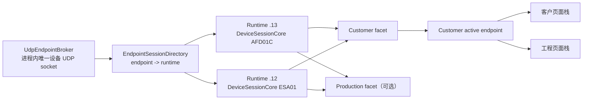

# M25 客户多设备共享会话计划

## 文档信息

| 项目 | 内容 |
|------|------|
| 日期 | 2026-09-01 |
| 状态 | Host 软件实现与验证完成；双真机与发布平台待验收 |
| 上位机基线 | `c9b44da`，计划创建前工作树干净 |
| 验收标准 | `doc/M25_customer_multi_device_sessions_acceptance.md` |
| 开发记录 | `doc/M25_customer_multi_device_sessions_dev_log.md` |

## 1. 目标与用户场景

客户工作区增加多设备会话和左侧设备列表。首版边界为最多 4 台显式配置的 UDP 设备，覆盖已注册客户产品 AFD01、AFD01C 和 ESA01。

目标场景：

- `192.168.1.13:4004` 的 AFD01C 与 `192.168.1.12:4004` 的 ESA01 使用同一个上位机本地 UDP socket 同时在线。
- 左侧设备列表显示每台设备的身份、endpoint、在线阶段和业务状态；选择设备只切换呈现和操作目标。
- 未选中的设备继续接收、解析、更新 Store、保持 Product Service 订阅并执行已经开始的录制或设备事务。
- 客户 Overview、RF、Maintenance 始终消费客户目录的“当前选中设备”事实。工程工作区选择“共享客户 UDP 会话”时，Live、Device、Tracking Simulator 和 Settings Profile 也跟随该 endpoint；工程显式选择串口时使用独立的工程串口会话。Playback/Log 继续使用自己的离线数据源。
- 切换设备不得重连、修改连接代际、清空 Store、重建权威 session 或把命令重定向到另一台设备。

## 2. 当前源码事实与根因

当前不能仅在 `CustomerWorkspace` 增加一个列表：

- `MainWindow` 只创建一个 `LiveView`，客户与工程呈现共同绑定这一个对象。
- `LiveView` 聚合了一个 `_worker`、一个 `DeviceSessionCore`、连接阶段、Product 订阅、Debug、录制和呈现定时器。
- `UdpWorker` 固定一个远端 endpoint，并丢弃其他来源；多个 `UdpWorker` 竞争同一本地端口会产生数据报接收归属风险。
- `SessionRegistry` 已能保证“一个 endpoint 一个权威 `DeviceSessionCore`”，但它只是注册表，不拥有共享 UDP ingress、连接阶段、订阅需求或客户设备选择。
- Overview、RF、Maintenance、Device 和 Tracking Simulator 在构造时绑定具体 Core/Store/Controller，直接把这些对象动态换绑到另一 session 容易产生残留信号、跨设备事务和 OTA scope 错配。

M19 试产已经证明多设备底层应采用一个 UDP socket，并按来源 `(source_ip, source_port)` 分流。M25 不再实现第二套客户 Hub 或第二套 endpoint decoder，而是把试产中已经成立的通用机制抽出，客户与试产共同使用。

## 3. 共用边界与独立边界

### 3.1 必须共用的通用能力

| 能力 | 唯一 owner | 客户消费者 | 试产消费者 |
|------|------------|------------|------------|
| 本地 UDP socket、收发和来源 endpoint | 进程级 `UdpEndpointBroker` | 显式 endpoint | CIDR 探测和已接纳 endpoint |
| endpoint 到 session 的映射 | 由现有 `SessionRegistry` 演进出的唯一 `EndpointSessionDirectory` | 客户设备条目 | 试产设备槽位 |
| 协议解析和各类 Store | `DeviceSessionCore` | Overview/RF/Maintenance/工程页 | 试产判定与证据 |
| 有效帧时效、共享 presence 与代际 | `EndpointSessionRuntime` | 客户 attached 后投影客户阶段 | 试产 facet 投影试产阶段 |
| 客户连接意图 | 客户设备目录 | `attached/detached` | 不消费 |
| 生产发现/接纳需求 | Production facet | 不消费 | CIDR claim、候选与 slot |
| Product Service 订阅 | 每 endpoint 一个订阅状态机 | 客户遥测需求 lease | 试产采集速率需求 lease |
| endpoint 定向发送 | Broker 的 `send_to(endpoint, frame)` | RF/OTA/参数/Debug | 试产订阅和只读请求 |
| 原始数据报时间与入口 | Broker/Runtime | 客户 SDB | 试产 SDB/指标 |

以下合同不可重复实现：

- 同一 endpoint 的数据报在进程内只进入一个 `FrameReceiverV2` 一次。
- 同一 endpoint 只有一个 `DeviceSessionCore`、一个连接代际和一个请求 ID 空间。
- 同一 endpoint 只有一个 Product Service 订阅状态机；多个消费者只通过 `acquire_subscription(owner, hz)`、`update_subscription(owner, hz)`、`release_subscription(owner)` 提交需求，状态机发送最大有效速率并保持一个 keepalive。
- 发送目标在请求创建时冻结为具体 endpoint/Core，不在实际发送时读取“当前选中设备”。
- persisted configuration、transport demand、facet observer、subscription demand 和 handshake demand 是五种不同 lease；配置存在本身不启动 socket，也不表示客户已连接。

### 3.2 继续留在试产域的能力

下列语义不进入客户页，也不通过 `customer_mode` 条件塞入通用类：

- CIDR 自动探测、固定 1~4 试产槽位和第五台拒绝。
- `production_product_policy()`、生产配方准入和 ESA01 生产不支持结论。
- 生产 slot/配方处置、离线 endpoint 自动迁移、批次身份绑定和参与者冻结。
- 批次 recorder、SNR 5 分钟缓存、试产 SQLite 事件和报告证据。

`FleetController` 继续是试产业务编排器，但它不再拥有第二个 UDP ingress 或第二条 raw feed 路径；它通过通用 Runtime 增加生产 facet。

### 3.3 继续留在客户域的能力

- 显式设备列表、当前选中设备和列表持久化。
- 客户产品准入，使用 `customer_product_policy()`；AFD01C protocol 8 与 ESA01 protocol 6 可同时存在。
- 客户全量录制协商、RF 控制、客户 Maintenance 和签名 OTA。
- 页面导航、设备选择和客户状态文案。

跨 endpoint 的已验证 UID/SN 重复索引属于通用 Directory 事实；客户 facet 据此告警并 fail closed，但不执行生产的 slot、MAC、配方或 endpoint 自动迁移策略。

ESA01 没有客户 OTA 产品合同，因此在混合在线时仍只显示其已注册客户能力，不能因复用试产或 AFD01C session 而开放 OTA。Production facet 对 ESA01 的 `UNSUPPORTED` 只影响生产接纳：不得把共享 Runtime/Core 标记为不支持、不得占生产 slot、不得停止客户订阅或禁用已 attached 的客户 RF 能力。

## 4. 目标架构

### 4.1 进程级 `UdpEndpointBroker`

- 从现有 `UdpFleetHub` 抽出单 socket、完整数据报接收、来源 endpoint、定向发送、统计和正常关闭能力，放入 `core/comm/`。
- 客户已连接设备注册精确 `(ip, port)` admission claim；运行中的试产发现注册 `CIDR + device_port` claim。一个来源只有被至少一个活动 claim 接纳时才进入路由，未被任何 claim 接纳的数据报只增加 ignored/rejected 统计。
- Broker 为每个 datagram 附带命中的 claim/facet 上下文，不能仅按“是否已有 Runtime”决定 Production 路由。只有已经建立权威 feed 的活动 Runtime 才跳过临时 receiver；只有已接纳 Production facet 的 endpoint 才跳过生产准入。
- 客户只有显式配置并发出连接意图后才取得精确 claim；不能因为 endpoint 位于生产 CIDR 内，就把生产候选暴露到客户目录。
- `send_to()` 使用同一个 socket 在调用线程同步 `sendto()`；socket 引用、发送和 close 竞争由同一把锁保护，返回 `True` 仅当 OS 返回的写入长度等于完整数据报长度。试产 discovery 也走该发送入口，不能保留“只成功放入本地队列”的旧含义。
- 设备接受、应用和物理 RF 仍分别等待协议响应、遥测读回和独立硬件证据。
- Broker 首个活动 transport/discovery demand 出现时绑定，最后一个此类 demand 释放后停止；单台掉线不停止 socket。

Production 准入按三种状态路由：

| endpoint 当前状态 | Production claim 命中后的唯一处理 |
|-------------------|------------------------------------|
| 只有客户 `ConfigurationLease`，Runtime dormant | 使用 endpoint 级临时 receiver 做生产候选解码；政策接纳后在同一 dormant Runtime 建立首个 transport epoch、增加 Production facet，并应用已解码记录。拒绝时不得把候选记录写入 dormant Core。 |
| Customer 已 attached，Runtime 已有权威 feed，但 Production 尚未接纳 | raw datagram 仍只 feed 现有 Core 一次；Production admission observer 消费同一批已解码记录，并通过 Runtime 提交临时订阅需求，不另发 discovery subscribe。接纳只增加 Production facet/lease，不重建 epoch。 |
| 没有 Runtime | 创建有界 endpoint candidate receiver；政策接纳后由 Directory 创建 Runtime/Core、建立 epoch并应用已解码记录，拒绝后销毁 candidate。 |

临时候选 receiver 以 source endpoint 为键跨 datagram 保留，直到接纳、拒绝或 `10 s` 无活动超时；同时最多 `64` 个候选，每候选累计最多 `64 KiB` 原始字节。已有 64 个时拒绝第 65 个新 source，不驱逐已有合法候选；单个 source 超过字节上限时只拒绝并清理该 source，进入 `10 s` cooldown。所有超限均计数；接纳只应用已经成功解码的类型化记录，绝不重喂 raw bytes。已接纳 Production facet 的 endpoint 才由 Runtime 订阅状态机完全取代 discovery probe。

Customer-active Runtime 进入生产准入时使用独立 `ProductionAdmissionLease` 聚合临时 observer 和 subscription demand，不取得 slot 或 mutation capability。政策接纳时原子提升为 Production facet lease；拒绝、`10 s` admission timeout、Production stop 或 Runtime epoch 结束时逆序释放 observer/demand、清空 pending policy state，目标订阅速率立即按剩余 owner 重算，不能残留 discovery keepalive。

统一本地端口只保留 `device_udp.local_port` 一个权威配置，并用
`config_migrations.device_udp_port_v1` 标记迁移完成。迁移必须在默认配置合并前检查原始 JSON，端口有效范围为 `1..65535`：

在任何字段迁移前先验证整个原始 `settings.json` 是可解析 JSON object。原文件不存在表示新安装；原文件存在但语法/顶层类型损坏时不得沿用当前“静默使用默认值”行为：

- Settings 原子保存维护 checksummed last-known-good `settings.json.bak`。主文件损坏而备份有效时先原子恢复并记录诊断，再执行迁移。
- 主/备都损坏时保留并隔离原始字节，Customer UDP、Broker 和 Production fail closed，所有 migration marker 均不得写入；非设备 UI/工程串口可用内存默认值，但不能覆盖损坏文件。
- 此时 Settings 进入 `read_only_recovery`：普通 `set()` 只改变本进程内存，`save()` 返回类型化失败且绝不写主/备文件。主题/语言切换、窗口关闭、应用退出及任何其他 preference autosave 都不能绕过；只有下一条 `REBUILD_DEVICE_SETTINGS` 事务可提交新文件。
- `SettingsDialog` 可导出主/备原文、hash 和解析错误；用户重新输入 unified local port/customer devices 并输入 `REBUILD_DEVICE_SETTINGS` 后，才从安全默认值构造一次原子新文件。重建文件直接包含当前 keys/markers且不含旧 UDP keys，不能把损坏内容当成空 devices/45678 自动提交。

1. marker 已存在时只认新 key：`device_udp.local_port` 有效且旧 key 不存在才正常启动；新 key 缺失/无效时按损坏配置 fail closed，绝不回退旧 key。若 marker 与有效新 key 同时存在但仍残留旧 key，先用一次原子文件替换清理旧 key，清理失败则 Broker 不启动。
2. marker 不存在但新 key 已存在且有效时选择新 key，随后执行同一原子迁移提交；新 key 无效时 fail closed。
3. 没有配置文件，或原始 JSON 中两个旧 key 都不存在时，使用 `45678`。
4. 原始 `udp.local_port` 与 `production.local_port` 都存在且分别为历史默认值 `45678`/`45679` 时，使用 `45678`。
5. 只存在一个有效旧 key 时继承该值；两个有效旧值相同也继承该值。
6. 一个旧值仍是其历史默认值、另一个是非默认有效值时，继承非默认值。
7. 两个旧值都是非默认且不同，或任一显式值无效时 fail closed：Broker 不启动，设置页提供明确的端口选择/修正入口；不得写迁移标记或删除旧值。
8. 成功选择后构造一个最终 JSON 快照：包含新 key 和 marker，且不包含 `udp.local_port`、`production.local_port`；用临时文件、flush/fsync 和原子 replace 一次提交。任一步失败都保留原文件不变，重复启动结果必须幂等。

### 4.2 `EndpointSessionDirectory` 与 Runtime

`EndpointSessionDirectory` 直接演进并取代当前 `SessionRegistry` 的 endpoint 权威映射，不能在旁边再维护一张 Runtime map。每个 endpoint 的五类 lease 各自表达一个肯定事实；RecoveryLedger tombstone 是独立持久安全事实，不是第六类生命周期 lease：

- `ConfigurationLease`：客户配置或页面 bundle 需要保留 Runtime/Core；自身不启动 socket。
- `TransportDemand`：客户连接意图或已接纳的生产设备需要活动传输。
- `FacetObserver`：Customer/Engineering/Production 观察该 Runtime 的领域状态。
- `SubscriptionDemand`：某 facet 需要的 Product Service 速率。
- `HandshakeDemand`：某 facet 需要 Debug Handshake。

每个 endpoint 的通用 Runtime 至少拥有：

- Directory 创建并返回的唯一 `DeviceSessionCore`。
- endpoint、共享 transport/presence、最后有效记录时间、连接代际和收发统计；不保存客户 attached/detached 意图。
- Broker sender、Handshake lease 和 Product Service 订阅 lease 仲裁。
- owner-scoped send capability 和唯一 `RuntimeOperationGate`。
- 身份快照引用和 consumer owner 集合。
- 原始数据报事件，供客户与试产各自的 recorder/facet 使用，但协议只解析一次。

Runtime 不包含 QWidget、试产 slot、批次 ID、客户 active selection 或具体报告策略。

`DeviceSessionCore.connected` 只表示共享 transport 存在，不授权任一 facet 发送。Runtime 向成功取得 TransportDemand 的 owner 先发放只允许 identity/Handshake/Subscription/read-only 探测的受限 `EndpointSendCapability`，也可向明确依赖该 demand 的 observer 发放派生受限 capability；共享 Engineering capability 只能派生自 Customer attachment，自己不增加 TransportDemand。capability 冻结 endpoint、Core generation、owner/facet、父 demand 和可用 operation class；Customer/Engineering capability 还冻结 `CustomerAttachmentScope`。页面/controller 不得直接持有 Broker sender 或调用裸 `DeviceSessionCore.send()`；内部 Handshake/Subscription 使用显式 system capability。

Runtime 另维护单调递增的 `PresenceEpoch` 和 `IdentityAuthorizationScope`。WAITING/STALE 后第一条有效记录开启新 PresenceEpoch；只有当前 epoch 新收到的稳定 UID/SN 达到产品策略要求，且本 epoch 已出现的 Debug/Product 身份来源全部一致，才原子把相应 owner capability 提升为普通 mutation。授权 scope 冻结 endpoint、Core generation、PresenceEpoch、身份事实及来源 cursors；旧 Store/ProfileCache、上一 epoch 的 UID/SN 或仅凭 endpoint 均不能授权。

presence 进入 stale、任一身份来源变化/冲突或必需来源失效时立即撤销 mutation promotion，Customer/Engineering/Production freeze 均 fail closed；恢复 ONLINE 后必须用新 epoch 身份重新提升，即使 Core generation 未变化。若撤权时已有 active mutation，controller 进入 TERMINATING 但不得立即向身份未确认的 endpoint 发送：只有当前 PresenceEpoch 重新确认与原 scope 相同的身份后，才临时开放原 operation 的 terminal 权限；确认成不同身份、发生冲突或终止超时则不向新设备发送，直接按 RecoveryLedger 合同保留原设备未知状态。

每次发送都在 Runtime owner 线程重新校验 capability 未撤销、父 demand/claim 仍存在、Core/attachment scope 匹配及 operation gate 允许；普通 mutation、Production freeze 和缩限 terminal 还必须校验当前 PresenceEpoch 与相应 IdentityAuthorizationScope/原身份 scope。受限身份、Handshake、Subscription 和 read-only 探测不以尚未建立的 IdentityAuthorizationScope 为前置条件，但仍受显式 allowlist、facet 和批次阶段约束。

发送 operation class 默认是 `MUTATING` 并 fail closed；`HANDSHAKE`、`PRODUCT_SUBSCRIPTION` 和无状态 `READ_ONLY_QUERY` 只是可被策略明确 allowlist 的非 mutation 类型，仍必须通过 facet/capability 与批次阶段校验。Production 批次冻结/运行时，只允许 batch owner 的 Production/system capability 发送所需的订阅、握手和只读查询；Customer/Engineering capability 的所有 operation class 都拒绝，新增或更新的客户 demand 保持 pending，批次释放后再统一 reconcile。此时“被动查看”只指消费已到达的 Runtime Store/raw stream，不包含主动查询。Customer detached 时即使 Production 保持 Core connected，全部客户/共享工程发送也必须产生 0 个 datagram；重新 attach 只发放新受限 capability，当前 PresenceEpoch 的身份授权完成后才恢复普通 mutation，且不增加 Core generation。

OS 完整写出后，Runtime 只发出一次不可变 `DatagramSentEvent`，包含 endpoint、host time、Core generation、owner/facet、operation class 和 frame bytes/fingerprint；客户/试产 recorder 各自订阅该唯一事件。发送失败只增加失败统计/事件，不能记录为“指令已发送”，也不能由 controller 与 Broker 重复记录 sent evidence。

传输与代际合同：

- 第一个 `TransportDemand` 建立实际 transport epoch，调用一次 `begin_connection()` 并增加一次 generation。
- 现有 transport epoch 上增加或释放非最后一个 demand，只改变 owner 集合，不重置 receiver、Store、request ID 或 generation。
- 最后一个 `TransportDemand` 释放后才结束 transport；`ConfigurationLease`/页面继续存在也不能让 socket 伪装为已连接。
- Production 先发现并使 Runtime ONLINE、Customer 后附着时，Customer 可立即读取已有有效身份/Store；附着不得调用 `begin_connection()` 或增加 generation。
- Customer 释放自己的连接意图后，其设备行必须显示 `DISCONNECTED`，即使 Production 仍持有 transport 且共享 presence 为 ONLINE；这时只释放客户 lease，Production 继续运行。
- 客户设备行阶段由“客户 attached 意图 + Runtime presence”投影：detached 为 `DISCONNECTED`；attached 且尚无有效帧为 `WAITING`；已有新鲜有效帧为 `ONLINE`；曾在线后超时且 attached 为 `RECONNECTING`。

客户连接意图另有单调递增的 `CustomerAttachmentScope`，至少包含 endpoint 和 attachment epoch；它与共享 Core generation 同时参与客户操作授权：

- 每次 attach/detach 都产生新的 attachment epoch。Production 保持 transport 时 Customer 重新连接可以复用 Runtime Store，但不能复用上一次客户 attachment 的任何操作授权。
- detach 前先收尾客户/共享工程 recorder；活动 mutation 由所属 controller 有界终止并释放当前 endpoint 的本地 owner。
- 终止得到明确证据后，controller 释放 gate，再增加 attachment epoch、撤销 capability、清 pending/确认框/artifact/草稿并释放 subscription、handshake、transport demand。
- 终止得到明确证据或达到有界超时后释放本地 gate；未确认设备结果只作为当前 endpoint 的展示事实，不创建跨重启状态，也不阻断其他 endpoint。
- 以上收口不得结束 Production 的 transport/订阅、修改 Core generation 或清空共享 Store。

> M25R（2026-09-03）已删除早期方案中的永久恢复台账、全局恢复阻断和 Settings 恢复中心。设备终态未确认时，各领域 controller 有界释放本地资源；后续 mutation 仍需重新满足当前 PresenceEpoch、身份与能力合同。

Handshake 与订阅不能通过重建连接实现：

- `DeviceSessionCore` 增加 `acquire_handshake(owner)` / `release_handshake(owner)` 对现有 transport 启停 Handshake；Production-first、Customer-later 时不得为启动 Handshake 清空连接代际和 Store。
- Runtime 提供 `acquire_subscription(owner, hz)`、`update_subscription(owner, hz)`、`release_subscription(owner)`；一个状态机使用 Core 的 request ID 空间，发送所有活动需求的最大速率，并在 generation 变化后只恢复这一条订阅流。
- 订阅 rate 只接受 `1..20 Hz`。首个 demand、最大 rate 升降或新 transport epoch 都立即用 Core 的下一个 request ID 发送；新 request 替代旧 pending ACK，旧 ACK 被忽略。最后一个 demand 释放时停止 timer、清空 pending/confirmed，不发送不存在于 wire contract 的 unsubscribe。
- demand 在暂时无 transport 时保持 pending，下一 epoch 自动恢复；显式 facet detach/stop 才释放。Handshake demand 同样在无 transport 时 pending，在每个新 epoch 只启动一个 Handshake，最后一个 demand 释放后停止。
- 已有权威 feed 的 Runtime 不再使用临时 receiver；Production admission 通过同一 Runtime 提交需求。Production 已接纳后，discovery、production 和 customer 不得各自发送 keepalive。

Runtime presence 使用单调时钟；只有完整 v2 envelope、CRC 正确、命令命中已注册 domain 且领域解码成功的类型化记录才刷新 `last_valid_record_at`。TransportDemand 已提交但尚无有效记录时为 WAITING；最后有效记录超过现有合同 `3.0 s` 时 shared presence 变 stale，attached 客户投影 RECONNECTING 并立即撤销当前 IdentityAuthorizationScope；恢复一条有效记录后开启新 PresenceEpoch、回到 ONLINE，但普通 mutation 继续禁用直到新鲜身份重新确认。

lease/claim 变更只在 Runtime 所属 Qt 主线程执行，并按以下顺序提交或逆序回滚：

| 意图 | 原子顺序与失败处理 |
|------|--------------------|
| Customer connect | 校验配置/阶段 → stage 新 attachment epoch → register exact claim → TransportDemand（首个 demand 负责 bind Broker）→ 受限 capability → HandshakeDemand → SubscriptionDemand → commit attached。任一 ownership 步骤失败均逆序释放并失效 staged scope；后续网络发送失败只进入 WAITING/统计，不伪报 connected rollback。 |
| Customer detach | recorder 先收尾；active mutation 由所属 controller 有界终止并释放本地 gate → 增加 attachment epoch并撤销 capability → 清本地 pending/确认框 → release subscription/handshake/transport/exact claim → commit DISCONNECTED。 |
| Production start/accept | start 先取得 CIDR claim/Broker demand；失败不进入 discovering。candidate policy 接纳后取得 facet observer → TransportDemand → 受限 production capability → SubscriptionDemand → 最后提交 slot/participant；当前 PresenceEpoch 身份满足授权策略后才提升 mutation/freeze。任一步失败逆序回滚，不占 slot。 |
| Production stop | 先完成/abort batch evidence → 撤销 capability/gate owner → release subscription/facet/transport；最后一个 fleet owner 再释放 CIDR claim/Broker demand。 |

重叠 exact/CIDR claim 独立引用计数；释放一个 facet 不能移除另一 facet 的 claim。仅配置、页面选择或 observer 不得隐式取得 transport/subscription/handshake/capability。

Broker 接收线程只在不持 socket lock 时发出不可变 datagram 的 queued signal；解析、Core/Store、request ID、lease 与 gate 状态只在 Runtime Qt owner 线程更新。关闭顺序为先撤销 capabilities/demands，再设置 Broker stop，持 socket lock 分离并 close socket，释放锁后等待线程，最后销毁 Runtime；任何路径都不得持 socket lock emit、等待 Qt 线程或删除 Core。专项测试覆盖 send-vs-close、recv-vs-close 和 shutdown lock order。

客户与试产同时消费同一 endpoint 时：

- 二者拿到同一个 Runtime/Core。
- Product 订阅由 Runtime 合并为一个发送者和一个 keepalive。
- Production facet 观察已解析记录，不得再次调用 `feed_bytes()`。
- customer/production 分别停止时只释放自己的 lease；最后一个 TransportDemand 才结束传输，所有 lease 都释放后 Directory 才销毁 Runtime/Core。

### 4.3 客户设备目录

客户目录用 `customer.devices` 保存 0~4 个显式 IPv4 endpoint，用 `customer.active_endpoint` 保存当前选择；规范化 `(ip, port)` 是设备配置键，attached/online/busy 均不持久化：

- 新增只创建配置并选择该条目，不自动连接；重复添加时选择已有设备，不创建重复条目。
- 只有发出 attach 连接意图后，未上电设备才保持 `WAITING` 并在上电后自动转 `ONLINE`；仅配置未连接的设备始终为 `DISCONNECTED`。
- 一台设备超时只把自己的阶段转为 `RECONNECTING`，其他设备不受影响。
- endpoint 只能在客户已 detached、录制已停止且没有 OTA/设备事务时编辑或删除。
- 编辑先完整校验目标，再原子替换配置；即使已有 4 台也允许用新 endpoint 替换当前项，不需要临时创建第五条。目标若与已有条目重复，则选择已有条目并保持源条目不变。
- 编辑成功创建新的 session scope；旧 Core、Store、OTA artifact、录制状态和待处理草稿不得迁移。
- 删除条目时关闭其页面 bundle 和设备归属浮窗；删除最后一台后显示空设备占位，Customer Playback 仍可使用。
- 删除当前条目后选择原索引处的下一条；没有下一条时选前一条，再没有则 active endpoint 为空。全局 Playback 内容不随这个选择规则改变。
- 配置顺序和当前选中 endpoint 持久化；应用启动后由用户明确连接。
- `customer.devices` 的原始 schema 是 0~4 个唯一 `{ip, port}`；IP 必须是有效 IPv4 单播地址，port 为 `1..65535`。`customer.active_endpoint` 只允许 null/缺失或列表成员，失配时重置 null 并提示，不自动连接。
- marker 已存在时只认新列表：列表缺失/损坏时 Customer facet fail closed，绝不回退旧 remote key；有效列表仍残留旧 key 时先原子清理，失败保持 Customer blocked。
- marker 不存在但原始新列表存在时，新列表（包括显式空列表）有效则优先并提交 marker，无效则 fail closed。新旧都不存在时新安装迁移为空列表；只有两个旧 remote key 同时存在且有效时迁移为唯一首项并设为 active；旧 IP/port 只存在一个或任一无效时 fail closed，不用默认值补齐。
- 成功迁移构造同一最终 JSON 快照，包含有效 devices/active/marker 且移除 `udp.remote_ip/remote_port`，用临时文件+flush/fsync+atomic replace 一次提交；失败保留原文件字节。设置页提供修正 damaged/partial 配置的入口，重复启动幂等。

生产的 UID/SN endpoint 自动迁移不自动改写客户显式配置。若同一 Runtime 同时有客户 owner，新的 endpoint 先呈现为冲突/待确认，避免客户控制目标静默改变。

Directory 维护跨 endpoint 的已验证 UID/SN 索引；重复身份是通用事实。Customer facet 显示冲突并 fail closed 所有 outbound wire mutation，但允许被动查看，也允许按标准前置条件执行 detach/Edit/Delete 等本地解冲操作；不执行生产 slot、MAC、配方或 endpoint 迁移。Production facet 继续拥有其更完整的 UID/SN/MAC 处置策略。

共享 UDP 的 Customer/Engineering/Production 普通 wire mutation 在 capability 提升前，必须在当前 `PresenceEpoch` 新收到并确认至少一个稳定 UID 或 SN，且该 epoch 已出现的全部身份来源一致；只有 endpoint、身份仍 pending、身份冲突或身份仍来自旧 Store/ProfileCache 时，只允许 Handshake/Product identity/read-only 探测和被动查看。工程串口继续使用其独立工程边界。同一 UID/SN 换 endpoint 不自动迁移客户配置，必须重新满足当前 endpoint 的身份授权。

## 5. 页面与交互

### 5.1 左侧设备列表

保留当前 `158 px` 侧栏宽度，避免扩大后压缩 1024×600 总览：

- 顶部新增“设备”区及添加、编辑、删除入口，最多 4 行；每行使用两行文本、ellipsis 和完整 tooltip。
- 第一行仅在当前 PresenceEpoch 身份已验证时显示当前 `型号 + SN`；旧 Store 身份只能标为历史信息，不能伪装成本次在线身份，未确认时以 endpoint 为主。
- 第二行显示 endpoint、短状态文字以及录制/事务标记；颜色只作辅助，`accessibleName`/tooltip 同步提供完整状态。
- capture-profile 恢复未确认时，目标设备额外显示“采集模式待重新同步”，不替代连接阶段。
- 在线但本次 PresenceEpoch 稳定身份尚未确认或冲突时，所有控制项保持禁用并显示肯定原因“等待本次在线身份确认”或“设备身份冲突”，不能只表现为按钮无响应。
- 下方继续显示“总览 / 射频控制 / 回放 / 维护”页面导航。
- 添加/编辑设备通过独立对话框输入 IP/端口；Overview 不再保留第二份可编辑 IP/端口状态源，只显示选中设备 endpoint 和设备级连接/断开操作。
- 空列表显示明确占位和添加入口；新增后不自动连接。运行时切换三档主题或中英文时，现有与延迟创建的设备项、页面和 tooltip 都立即使用当前语义样式与语言。

### 5.2 每设备页面实例

不把已经永久绑定 Store/Core/Controller 的页面对象动态 rebind：

- 每个 endpoint 按需创建自己的 Overview、RF、Maintenance 和相应工程 Live/Device/Tracking Simulator 页面实例。
- 0 台或没有 active endpoint 时，Customer Overview/RF/Maintenance 与工程共享 UDP 页面显示统一空状态及添加/选择引导，不构造伪 Core；全局 Playback/Log 仍正常使用。
- 设备切换只执行旧页面 `deactivate_view()`、切换 stack、再对新页面 `activate_view()`。
- 未选中页面停止曲线、3D、表格等呈现定时器；Runtime、订阅、录制、OTA 和其他业务状态继续。
- 当前子页面在设备切换后保持不变，例如从 AFD01C 的 RF 页切到 ESA01 后仍显示 ESA01 的 RF 页。
- Customer Playback、Engineering Playback 和 Log 使用离线数据源，继续保持全局单实例；在 Playback 可见时选择另一台设备只更新 active endpoint，不替换、清空或重建当前离线回放内容。
- GNSS、Orbit、组件温度等辅助窗口属于创建它的 endpoint，标题包含型号/SN 或 endpoint，永不动态 rebind；删除设备或退出应用时关闭其窗口。
- 所有设备来源消息的信号都携带创建时冻结的 scope，由状态栏在消费时格式化型号/SN + endpoint；当前与非当前设备都显示归属，不能在消费时读取可能已切换的 active endpoint。

### 5.3 操作目标与安全

- RF、参数、OTA、安装姿态、Debug 和 Tracking Simulator controller 始终构造在具体 Runtime/Core 上。
- 所有客户 controller 和确认对话框同时冻结 `DeviceSessionScope` 与 `CustomerAttachmentScope`；两者任一失配都 fail closed。
- 切换设备不取消已经发送的事务；旧设备的 controller 继续等待匹配响应和后续遥测，设备行显示 busy，切回后立即恢复当前状态。
- 尚未确认的 TX 对话框在设备切换时失效或关闭；任何确认都必须绑定弹窗创建时捕获的 `DeviceSessionScope`，不能作用于新选中设备。
- 两台设备使用相同 `request_id` 时，响应仍因 endpoint/Core 隔离而只能推进各自事务。
- 切换、断开、删除或 endpoint 修改不得复用另一设备的 OTA artifact token、维护草稿或参数状态。
- 一台设备 detach 按 attachment epoch 合同取消自己的客户事务；其他设备及同 Runtime 的 Production transport/批次继续。

工程连接边界保持单义：

- 工程页显式选择“共享客户 UDP 会话”或“工程串口会话”。共享 UDP 模式只是 Customer attachment 的 observer/控制消费者，不独立取得 TransportDemand，也没有自己的 UDP Connect/Disconnect；0 台、未选择或选中设备 detached 时显示明确空状态，绝不自动连接、回退旧地址或借 Production transport 发送。
- Customer 选择另一 endpoint 时，共享工程切换到对应 lazy bundle；旧 endpoint 已开始的工程事务可在其 Customer attachment 仍有效时继续。Customer detach 请求进入 TERMINATING，terminal/recovery 转换完成后才撤销该 endpoint 的共享工程 capability。
- 已配置 UDP endpoint 的 Type/IP/remote port/local port 在 Engineering Live 中只读；新增或修改 UDP 地址必须进入客户设备目录，不能绕过 Directory 创建第二个地址 owner。
- Settings、Live、Device 和 Tracking Simulator 在共享 UDP 模式使用当前 endpoint 的 ProfileStore/Core；切换到串口模式后使用工程串口会话自己的 ProfileStore/Core。Device、Tracking、Settings 和所有确认框持续显示当前或冻结的型号/SN + endpoint。
- 工程模式切换是显式边界：任一工程 recorder、OTA 或设备事务活动时拒绝切换并要求先完成/取消；进入串口前共享工程 observer/capability 全部释放，进入共享 UDP 前串口必须明确断开且无事务/录制。切换不动态 rebind 页面、不隐式断开任何 Customer session。
- 共享 UDP 的工程 Record 保留现有“当前流原始录制”语义：它是 endpoint-bound passive host observer，不发送 capture-profile，不冒充客户 full-support SDB，并在 metadata 写 `recording_mode=engineering_current_stream`。它受同一 recording path registry、每设备 busy/切换/detach 生命周期约束；因不发 wire mutation，可在 Production batch 中写独立路径。串口工程 recorder 使用同一全局 path registry，但只属于串口会话。
- 全局端口冲突修正入口属于 `SettingsDialog`，即使 0 台设备或 Broker 未启动也可进入；有任一活动 transport/discovery demand 时只读，全部 demand 释放后才能原子修改，下一次 bind 生效。

### 5.4 录制路径与 writer 所有权

- 每台设备保留独立客户 recorder；获准启动的客户或试产 recorder 都订阅 Runtime 的同一次 raw feed，并各自写独立证据文件，不能自行再次解析协议。
- 客户默认文件名包含时间和规范化 endpoint，例如 `customer_20260901_120000_192-168-1-13_4004.sdb`；目标已存在时使用确定性序号创建新文件，不覆盖旧文件。
- recording path canonical key 由已存在父目录的真实路径、NFC 文件名组成，并在 Windows/macOS 做 case-fold；这会把 `..`、symlink、大小写和 Unicode 等价别名归并到同一安全键。
- 进程级 recording path registry 对 canonical key 发放独占 lease，并用 `O_CREAT|O_EXCL` 创建目标，返回同时拥有 fd、path lease 和创建文件 identity 的 `RecordingReservation`。默认路径冲突时循环确定性序号，用户指定已有/活动路径时明确拒绝；任何路径都不得以 `wb` 重新打开或覆盖。
- `DataRecorder.start(reservation)` 在调用边界一次性接管 reservation；调用后无论成功/失败，caller 都不得再 close/release。成功时 recorder 持有 fd/lease 到 stop；header/schema/首写任一步失败时 recorder 关闭 fd、释放 lease，并按保存的 inode/file identity 只删除自己创建的空/半成品，删除失败则改名为 `.failed` 隔离，绝不留下貌似有效的 `.sdb`。reservation 未交付时由其 context manager 收尾。
- 正常 detach、编辑或删除前先完成 recorder 收尾及 capture-profile restore；切换当前设备不停止录制。restore 不能确认时按下一条 UNKNOWN/fail-closed 合同处理。
- 客户录制依赖 `SET_CAPTURE_PROFILE support_full`，因此它是 mutating operation，不定义证据较弱的“被动客户录制”旁路。recording owner 从 profile 协商前一直持有同一个可重入 gate lease，直至 writer 收尾和 customer profile restore 确认后释放。同一 Runtime 的客户录制与 Production 批次冻结/运行互斥：活动客户录制阻止 freeze，已冻结/运行的参与者禁止启动客户录制；其他 endpoint 仍可独立录制。
- restore 无法确认时 writer 仍须有界关闭，Runtime 将 capture-profile safety fact 标记为 `UNKNOWN` 并写入同一 RecoveryLedger；用户明确确认后可 detach，但 Production 不得 freeze，客户也不得开始新 mutation，直到新 epoch 上显式恢复/验证所需 profile。不能因释放 QObject/gate 就伪报 customer profile 已恢复。

### 5.5 客户控制与生产批次仲裁

- `RuntimeOperationGate` 直接承接并取代当前 `DeviceSessionCore` 的 device-transaction lock；不得保留第二把 controller/core 锁或两套 owner。现有 transaction API 要么删除，要么只委托同一个 gate/CAS。
- Customer/Engineering mutation owner 与 Production batch-freeze owner 在同一原子 CAS 上互斥；完成、明确终止、batch abort/finalize 经唯一 owner 路径幂等释放。detach、最后 transport demand 释放、generation 变化或对象销毁遇到未确认 device mutation 时转入 Directory RecoveryLedger tombstone，不能盲目释放为 IDLE。
- Runtime 已成为冻结或运行中的生产批次参与者时，Customer/Engineering 的 RF/TX、OTA、参数、Debug、read query、capture-profile/客户录制、安装姿态和 Tracking Simulator 等所有设备 outbound fail closed；只允许消费现有 Store/raw stream。Production/system 仅按 batch owner allowlist 发送。
- 客户变更事务已开始时，Production 不能冻结该设备为批次参与者，并明确显示“设备操作中/未就绪”；不能接纳后再静默记为 INCOMPLETE。
- gate 只限制同一 Runtime；其他设备及离线 Playback 不受影响。设备接受、遥测应用和物理 RF 的证据边界不变。

## 6. 实施顺序

### 阶段 A：通用层抽取并回归试产

1. 为现有 `UdpFleetHub`、`DeviceSession` 和 `FleetController` 增加行为锁定测试。
2. 抽取 `UdpEndpointBroker`、admission claim、endpoint datagram、同步发送和通用统计。
3. 让 `EndpointSessionDirectory/Runtime` 演进取代 `SessionRegistry`，闭合五类 lease，由其唯一 feed `DeviceSessionCore`。
4. 增加既有 transport 上的 Handshake demand、单 Product 订阅需求仲裁、owner-scoped send capability、通用身份索引、唯一 operation gate 和持久 RecoveryLedger。
5. 将 Production Fleet 改为通用 Runtime 上的生产 facet，删除被取代的 socket、decoder、发送队列和重复订阅 owner。
6. 全量运行试产 Fleet、ProductionWorkspace、Directory、录制和批次仲裁回归。

### 阶段 B：客户多设备领域

1. 增加显式客户设备目录、持久化迁移和 active endpoint。
2. 将 `LiveView` 中属于单设备连接/在线/订阅/录制的状态迁移到 Runtime 或每设备 controller。
3. 建立每 endpoint 的客户/工程 lazy 页面 bundle；不增加第二套权威 Store。
4. 接入左侧设备列表、添加/编辑/连接/断开/删除、空状态和可访问状态呈现。
5. 增加工程序列/共享 UDP 模式、只读 endpoint、ProfileStore 跟随及设备归属消息/浮窗生命周期。
6. 增加 recorder 默认文件名与进程级活动路径 lease；改造 `DataRecorder.start(RecordingReservation)` 明确转移 fd/lease 所有权，删除固定 `open(path, "wb")` 覆盖入口，并回归客户/工程/试产 recorder。

### 阶段 C：安全、文档与验证

1. 覆盖 RF/TX、OTA、参数、录制和 Tracking Simulator 的跨设备隔离。
2. 更新中英文翻译、`AGENTS.md`、vNext 功能定义、专用客户工作区中英文指南和持久化路径说明；历史 M16 `user_manual*.md` 不冒充当前客户手册。
3. 执行专项、全量、布局与 host 性能验证；真实 LAN IP 只用于台架，自动化使用 loopback/注入 endpoint。
4. macOS/Windows 打包与 DPI 冒烟作为独立平台验收，双真机作为独立硬件验收，不用 host PASS 代替。
5. 对照本计划与验收文档 review，删除旧单设备地址 owner、重复 socket 路径、无效兼容分支和失效测试。

Host 性能门槛固定为：至少两台 attached、全部页面预热后，以 active-selection signal 到目标 `activate_view()` 返回的 `QElapsedTimer` 时长测 200 次设备热切换，p95 不超过 `10 ms`、最大不超过 `50 ms`；单个页面 bundle 首次延迟创建不超过 `500 ms`。独立 soak 使用四个 loopback endpoint、每台 `20 Hz`、四个独立客户 recorder 连续 `30 min`，每 `100 ms` 投递一次主线程 latency marker；Broker socket 始终为 1、每 endpoint 恰有一个 Runtime/Core、跨路由/重复解析错误为 0、非故障注入导致的 queue/recorder drop 为 0，UI 延迟 p95 不超过 `100 ms`。无 transport/discovery demand 时 socket 必须为 0；报告记录机器/CPU/OS/Python/PySide6 及 offscreen/打包环境。

## 7. 预计修改范围

核心范围：

- `satellite_debug_tool/core/comm/`
- `satellite_debug_tool/core/session/`
- `satellite_debug_tool/core/session/recovery_ledger.py`
- `satellite_debug_tool/core/production/fleet.py`
- `satellite_debug_tool/core/config.py`
- `satellite_debug_tool/io/data_recorder.py`
- `satellite_debug_tool/io/recording_path_registry.py`
- `satellite_debug_tool/ui/main_window.py`
- `satellite_debug_tool/ui/live_view.py`
- `satellite_debug_tool/ui/customer_workspace.py`
- `satellite_debug_tool/ui/customer_overview_view.py`
- `satellite_debug_tool/ui/settings_dialog.py`
- 客户 RF/Maintenance、工程 Device/Tracking 的 session-bound 构建入口
- `satellite_debug_tool/tests/`
- i18n TS/QM、`AGENTS.md`、vNext 和配置说明
- 新的客户工作区中英文指南（不改写 M16 工程手册的历史定位）

实施中若发现必须修改设备固件或 Product Service wire bytes，立即停止并单独提交协议变更计划；M25 当前不授权固件或 wire-contract 修改。

## 8. 明确不做

- 不复制一套 customer-only UDP Hub、Fleet 或 SessionRegistry。
- 不向 `FleetController` 增加大量 `customer_mode` 条件分支。
- 不增加自动网段扫描到客户页；客户设备由用户显式配置。
- 不支持多个串口设备同时在线；串口继续属于工程单设备连接边界。
- 不把设备列表选择当成设备在线、设备接受、状态已应用或物理 RF 证据。
- 不把 ESA01 纳入试产配方或开放 ESA01 客户 OTA。
- 不在本阶段自动 commit、tag、push 或发布。

## 9. 需要确认的首版产品决定

本计划按以下默认值进入实现，用户确认时可调整：

1. 客户设备容量固定为最多 4 台。
2. 客户多设备首版只支持显式 IPv4 UDP endpoint，不做自动发现和多串口。
3. 客户与试产统一使用一个进程级设备 UDP socket 和一个权威本地端口。
4. 每设备页面按需创建；切走设备后业务事务继续，只有呈现停止。
5. 左栏保持 158 px，设备行使用两行省略显示，避免扩大现有工作区。
6. 工程“共享客户 UDP”只复用客户 attachment，不另建 UDP 连接；工程串口保持独立单会话。
7. 同一设备的客户 full-capture 录制/变更操作与冻结或运行中的 Production 批次互斥，不新增被动录制旁路。
8. Customer detach 前先结束录制；活动 OTA/设备事务由所属 controller 有界收口，未确认结果不伪报为成功。
9. 共享 UDP 的普通设备变更必须先有当前 `PresenceEpoch` 新鲜验证、各来源一致的稳定 UID/SN；presence stale、身份变化或冲突立即撤权。
